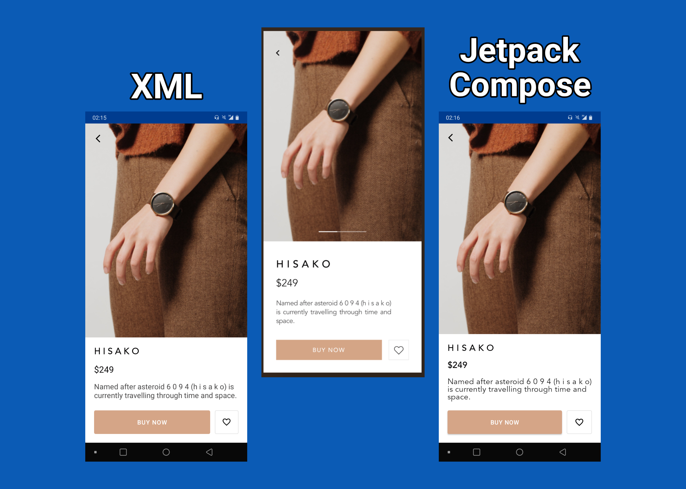
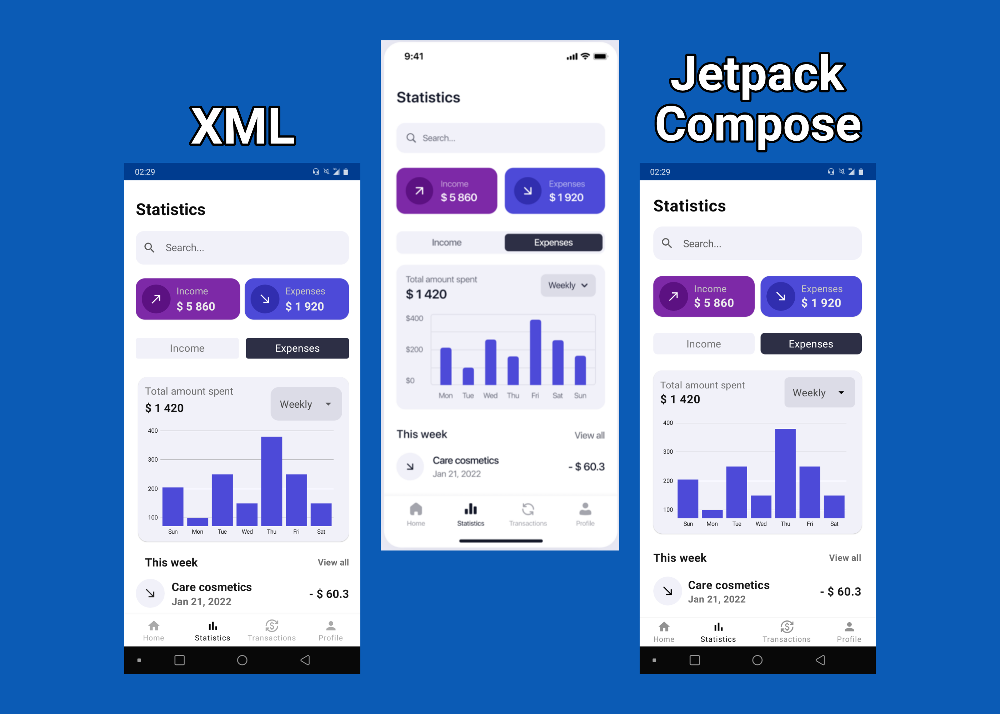

## Cleidesigns - UI created in XML and Jetpack Compose
<p align="center">
  
  <br/>
</p>

This project was created with the purpose of exercising and improving my knowledge in creating Android interfaces.
In addition to trying to get close to the original design, I'm trying to use components and implementations that would normally be used in a "real" scenario, since if the goal was just to make it look similar, some of the item lists could be created with just component duplication, instead of using a RecyclerView and all that it implies (adapters, models etc.), for example.

In addition to the traditional XML implementation, the project also contains versions created using Jetpack Compose, which in my humble opinion is already much faster, easier and more intuitive to create interfaces.

## Organization

Designs are separated into folders for better organization, such as **design1, design2, design3...**, where each folder contains classes used in that design itself, such as models or utils classes.
Specific design files contain a prefix to better identify which screen the file is being used on, such as **design1_image**.

## Test it yourself

You can download the app to test on your device, just access the project  [releases](https://github.com/jsericksk/Cleidesigns/releases) and download the apk.


## License
```
MIT License

Copyright (c) 2022 Ericks

Permission is hereby granted, free of charge, to any person obtaining a copy
of this software and associated documentation files (the "Software"), to deal
in the Software without restriction, including without limitation the rights
to use, copy, modify, merge, publish, distribute, sublicense, and/or sell
copies of the Software, and to permit persons to whom the Software is
furnished to do so, subject to the following conditions:

The above copyright notice and this permission notice shall be included in all
copies or substantial portions of the Software.

THE SOFTWARE IS PROVIDED "AS IS", WITHOUT WARRANTY OF ANY KIND, EXPRESS OR
IMPLIED, INCLUDING BUT NOT LIMITED TO THE WARRANTIES OF MERCHANTABILITY,
FITNESS FOR A PARTICULAR PURPOSE AND NONINFRINGEMENT. IN NO EVENT SHALL THE
AUTHORS OR COPYRIGHT HOLDERS BE LIABLE FOR ANY CLAIM, DAMAGES OR OTHER
LIABILITY, WHETHER IN AN ACTION OF CONTRACT, TORT OR OTHERWISE, ARISING FROM,
OUT OF OR IN CONNECTION WITH THE SOFTWARE OR THE USE OR OTHER DEALINGS IN THE
SOFTWARE.
```
